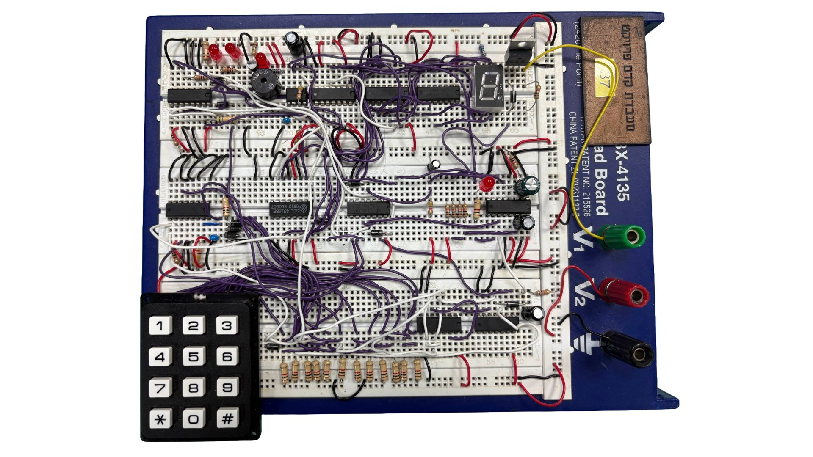
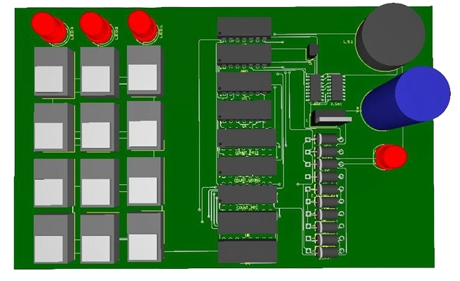
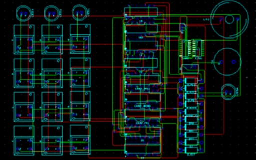

# Digital Safe Lock 🔐  
*A pure-logic electronic safe system built entirely without microcontrollers.*

---

## Overview
This project implements a **three-digit electronic safe lock** designed and built using **only discrete logic components** — no microcontrollers, no Arduino, no programmable chips.  
It verifies a user code, unlocks for a fixed time interval, and triggers an alarm after consecutive failed attempts.

Developed as part of the **Electrical & Electronics Engineering Pre-Capstone Project** at **Ariel University**.

---

## Features
- ✅ Pure hardware design — **no programmable devices**
- ⚙️ Built entirely from **flip-flops, counters, logic gates, timers**
- 🧩 5-second automatic unlock timer with LED and countdown display
- 🚨 Buzzer and LED alarm after 3 wrong code entries
- 🔄 Manual reset using `*` or `#`
- 🖲️ PCB designed, fabricated, and verified for reliability

---

## System Architecture
The system is composed of **four synchronized subsystems**:

1. **Code Input & Verification** – Keypad → flip-flops + counter → sequence match (digits `8-1-7`)
2. **Safe Opening** – Monostable CD4538 + MOSFET IRFB7446 → 5 s unlock & LED
3. **Error Handling** – Counter + BC547 transistor → 3-strike alarm logic
4. **Reset Control** – Diode-isolated reset lines for safe clearing of states

---

## Hardware Components

| Component | Function |
|------------|-----------|
| 4013 | D Flip-Flops for code storage |
| 4516 | Binary counter for key sequence tracking |
| 4538 | Monostable multivibrator (5 s pulse generation) |
| 555 | Clock & timing pulse generation |
| 4543 | BCD → 7-segment decoder |
| IRFB7446 | Power MOSFET controlling lock actuator |
| BC547 | Transistor driving buzzer |
| RC networks, LEDs, diodes | Debouncing & feedback circuits |

---

## Design Highlights
- **Noise-free input:** RC filters and pull-down resistors (1 kΩ–600 kΩ) ensured stable signals and prevented ghost presses.  
- **Logic reuse:** XOR gates substituted for NOT to stay within the 15-component limit.  
- **Auto lock:** Safe relocks automatically after 5 s if the door is not opened.  
- **Reset flexibility:** `*` or `#` keys instantly clear all counters and flip-flops.

---

## Results
| Event | System Response |
|--------|-----------------|
| ✅ Correct code | Unlocks for 5 s, LED ON, 7-segment countdown |
| ⚠️ Wrong code | Warning LEDs indicate error count |
| 🚨 3 wrong codes | Buzzer + red LED for 3 s |
| 🔄 Reset | Full system reset via `*` or `#` |

---

## PCB Design
| 3D View | 2D Layout |
|----------|-----------|
|  |  |

---

## Testing
Timing verification was performed using an **Arduino as a measurement tool**, confirming:
- 5 s ± 2% unlock interval  
- Clean RC-debounced transitions  
- Reliable reset and alarm responses

---

## Lessons Learned
- **Digital logic can scale** – flip-flops + counters can form full authentication logic.  
- **Analog-digital interaction** – RC timing is essential for stability.  
- **Engineering creativity** – logical hacks (e.g., XOR → NOT) keep systems minimal.  
- **Resilience under constraints** – successful hardware design without lab access.

---

## Full Documentation
📘 [Read the full engineering article](https://ronelherzass.com/post.html?lang=en&slug=safe-lock-project)  
Includes full schematics, background theory, and timing analysis.

---

## Credits
**Ronel Herzass** · **Nadav Talbi**  
Supervisors: **Yair Hayon** & **Lidor Batzon**  
_Ariel University – Faculty of Electrical & Electronics Engineering_

---

## License
Released under the [MIT License](LICENSE).
